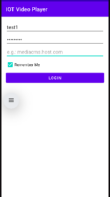
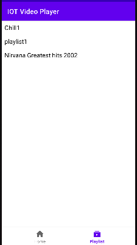
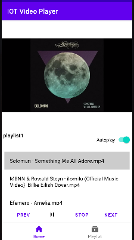

# IOT Video Player

**IOT Video Player** is an Android application designed for playing and managing video content with an easy-to-use interface and powerful media playback capabilities. 
It allows users to play, pause, stop, and skip videos, manage playlists, and handle background playback seamlessly.
This application only works with MediaCMS, a modern, fully featured open source video and media CMS. More info https://github.com/mediacms-io/mediacms

## Features

- **Media Playback**: Supports playing, pausing, and stopping video content using ExoPlayer for smooth media playback.
- **Notification Controls**: Control media playback (play, pause, next track) directly from the notification bar while the app is in the background.
- **Playlist Management**: Load and manage video playlists efficiently, displaying video lists inside the app.
- **Background Playback**: The player continues playing video in the background with foreground notification support.
- **Autoplay**: An autoplay option that automatically plays the next video in the playlist when the current one finishes.
- **Call and Headphone Handling**: Automatically pauses playback when a phone call is received or when headphones are disconnected.
- **Network Customization**: Users can specify a custom hostname to interact with specific APIs or servers.
- **Audio Focus Handling**: Manages audio focus to ensure smooth interaction with other apps, such as pausing when a call comes in.

## Important notes

- The code was written to learn and just make it work, so there may be some parts that be done better.
- Contains a lot of bugs, so beware. But it works most of the time.
- The UI/UX is simple, nothing fancy and probably will never be!
- This only works with playlist now. So, in your MediaCMS instance you have to create playlists that you can select to play the videos.
- Only videos with 360p are supported now.
- Portrait mode has not been implemented yet, it might work but I not sure it won't crash.

## Requirements

- Android 5.0 (Lollipop) and above
- Internet connection for fetching remote videos (if required)
- A MediaCMS instance with a public hostname and access.

## Getting Started

To set up the player:

1. Clone this repository:
   ```bash
   git clone https://github.com/your-repo/iot-video-player.git
   ```
2. Open the project in Android Studio.

3. Add your API's hostname during login (via the newly added hostname input field).

4. Run the app on your Android device or emulator.

## Usage

You need a login Username and Password from an installed MediaCMS instance. You will also need the hostname of the MediaCMS instance that you will login using the app.

## Screenshots





## Contributing

Feel free to submit issues or contribute to the development of this project. Pull requests are welcome!

## License

Free for personal use. Ask about licensing for commercial use.
